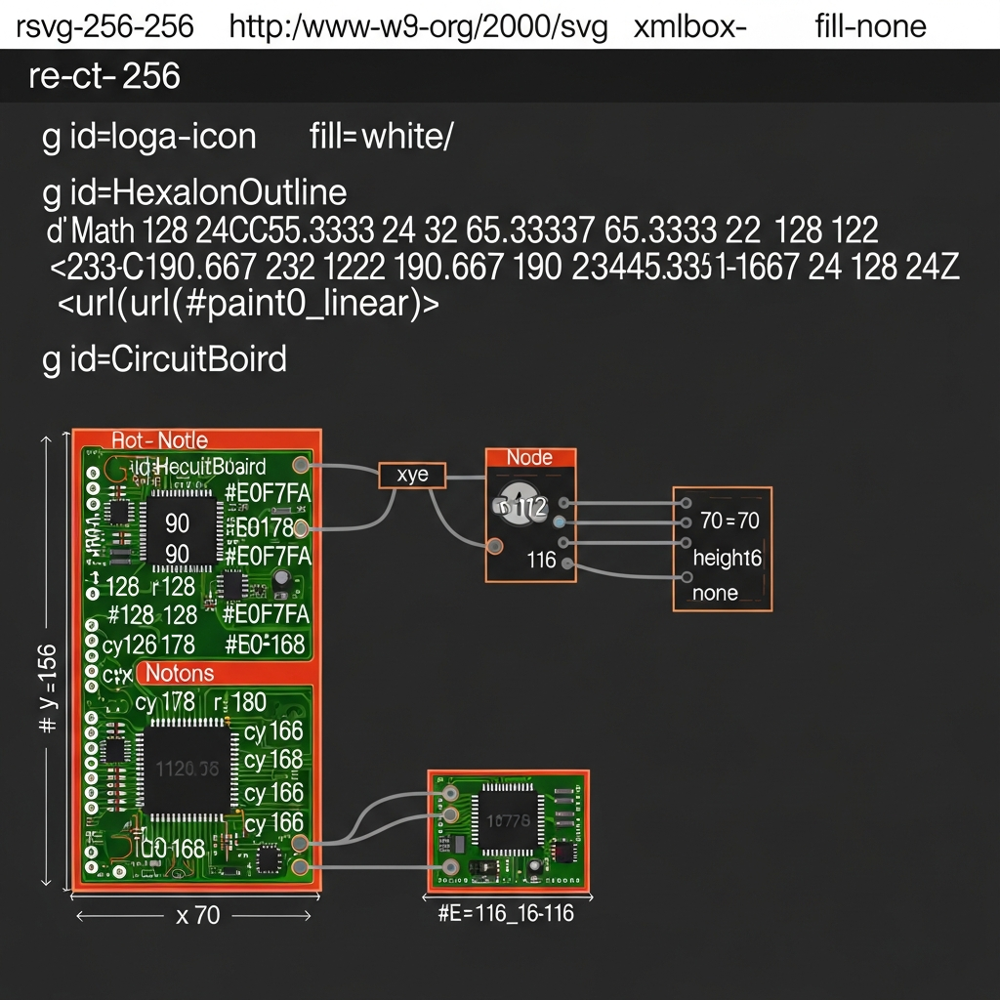
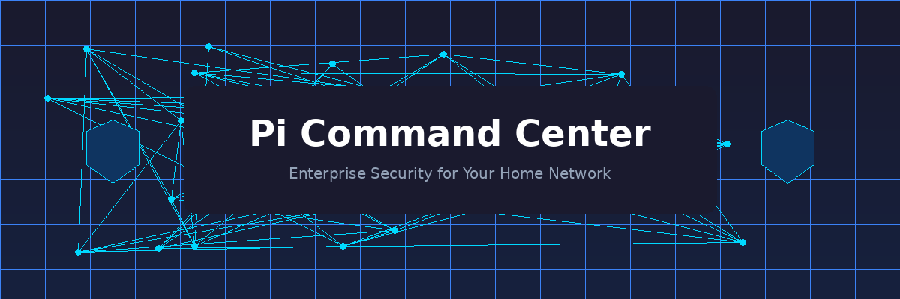
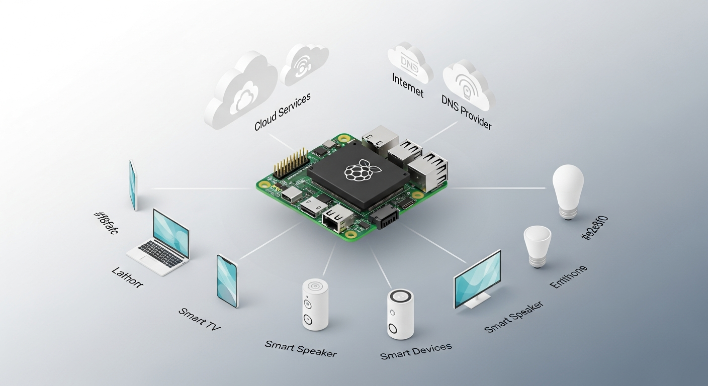
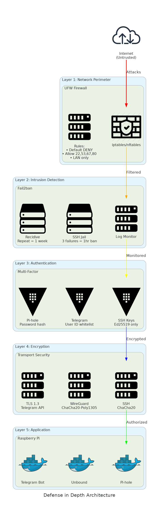
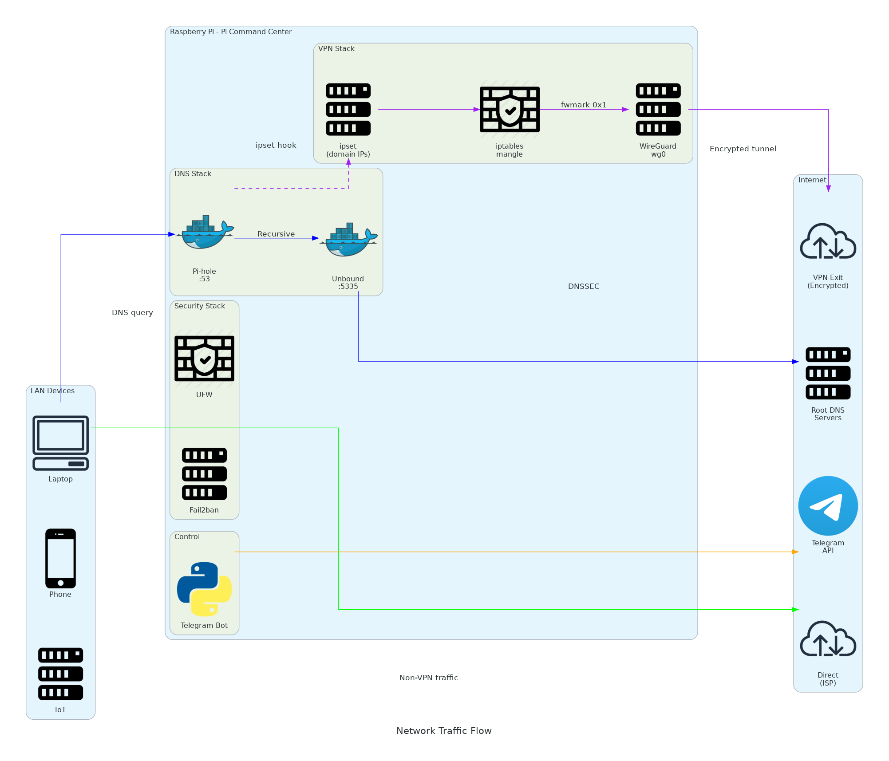
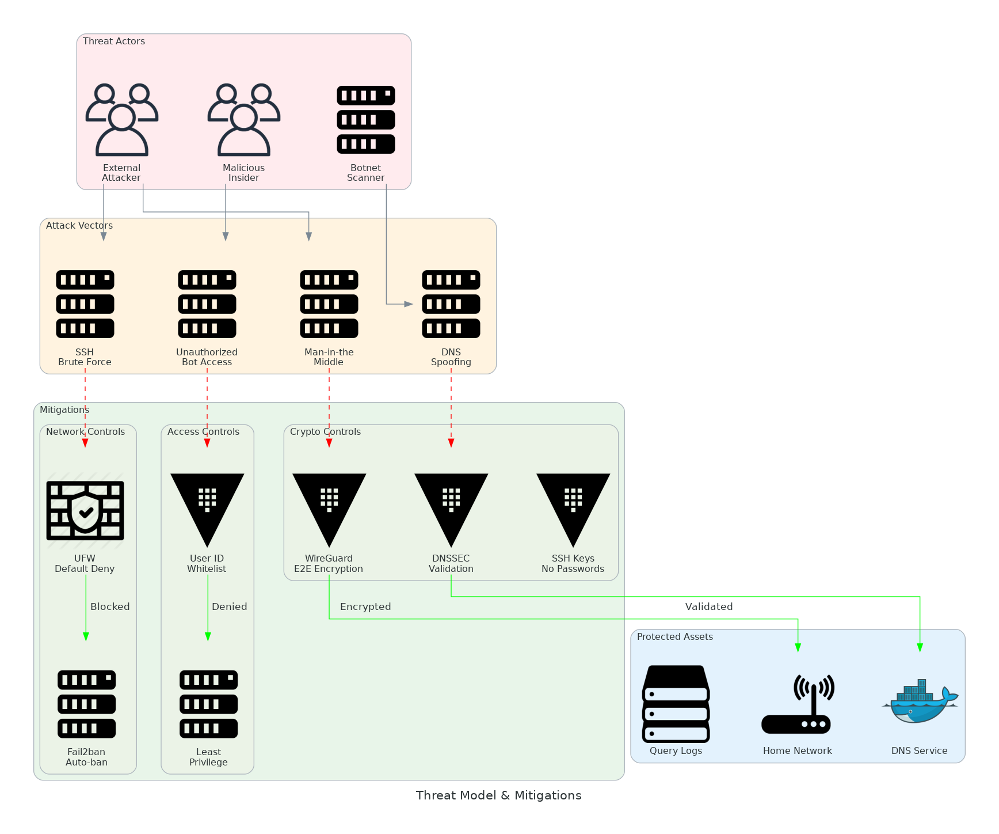
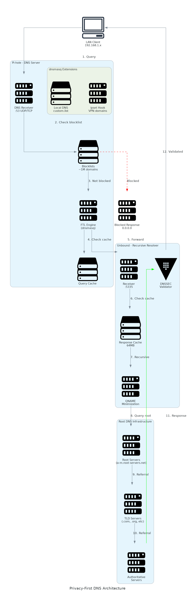
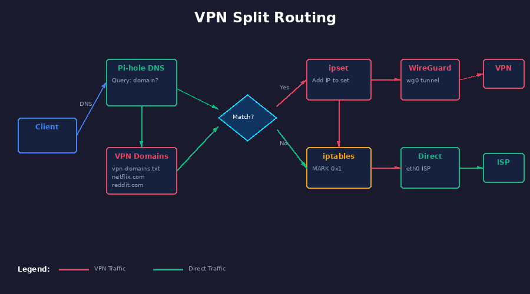
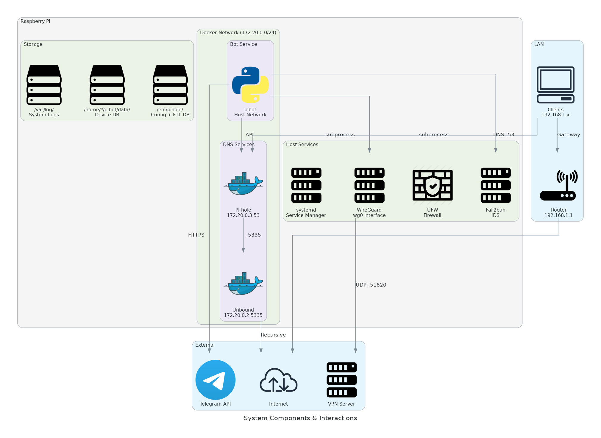

<div align="center">



# Pi Command Center

### Your Home Network Deserves Enterprise-Grade Security

**The open-source security platform that transforms a $35 Raspberry Pi into a privacy fortress.**



[](https://github.com/judariva/pi-command-center/stargazers)
[](LICENSE)
[](docs/SECURITY.md)
[](docker-compose.yml)

<br/>

[**Quick Start**](#-quick-start) · [**Why This Exists**](#-why-this-exists) · [**Features**](#-features) · [**Security**](#-security-architecture) · [**Docs**](docs/)

<br/>

---

### Trusted by Security Professionals

<sub>Built with Zero Trust principles • OWASP aligned • CIS benchmarked</sub>

</div>

<br/>

## ⚡ Quick Start

Get enterprise security running in **under 5 minutes**:

```bash
# One command deployment
curl -sSL https://raw.githubusercontent.com/judariva/pi-command-center/main/install.sh | bash
```

<details>
<summary><b>📋 Manual Installation</b></summary>

```bash
git clone https://github.com/judariva/pi-command-center.git
cd pi-command-center
cp .env.example .env
# Edit .env with your Telegram token
docker compose up -d
```

**Requirements:**
- Raspberry Pi 3B+ or newer
- Docker & Docker Compose
- 5 minutes of your time

</details>

<br/>

## 🎯 Why This Exists

<table>
<tr>
<td width="50%">

### The Problem

Every day, your home network leaks data:

- 📡 **DNS queries** go to Google/Cloudflare (they see every site you visit)
- 🎯 **Ads & trackers** profile your family across devices
- 🔓 **No intrusion detection** means attacks go unnoticed
- 🌍 **Geo-restrictions** block content you're paying for

**Your ISP, Big Tech, and advertisers know more about your family than you do.**

</td>
<td width="50%">

### The Solution

Pi Command Center gives you back control:

- 🛡️ **Recursive DNS** - queries go directly to root servers
- 🚫 **1M+ blocked domains** - ads and trackers eliminated
- 🔐 **5-layer security** - enterprise defense-in-depth
- 🌐 **Smart VPN routing** - geo-unlock what you want
- 📱 **Telegram control** - manage everything from your phone

**Your data stays on YOUR hardware.**

</td>
</tr>
</table>

<br/>

## 🏆 What Makes This Different

<div align="center">

| Feature | Pi Command Center | Pi-hole Alone | Commercial Solutions |
|:--------|:----------------:|:-------------:|:-------------------:|
| **No third-party DNS** | ✅ Unbound recursive | ❌ Forwards to Google/CF | ❌ Their servers |
| **VPN split routing** | ✅ Domain-based | ❌ Not included | ⚠️ All-or-nothing |
| **Intrusion detection** | ✅ Fail2ban + alerts | ❌ Not included | ✅ Yes |
| **Mobile control** | ✅ Telegram bot | ❌ Web only | ⚠️ Their app |
| **Defense in depth** | ✅ 5 layers | ⚠️ 1 layer | ✅ Yes |
| **Self-hosted** | ✅ Your hardware | ✅ Your hardware | ❌ Their cloud |
| **Open source** | ✅ MIT License | ✅ Open source | ❌ Proprietary |
| **Cost** | **$0** | **$0** | **$100+/year** |

</div>

<br/>

## 🔥 Features

<div align="center">

</div>

<br/>

<table>
<tr>
<td width="33%" valign="top">

### 🛡️ Privacy-First DNS

**Your browsing history stays private.**

- Unbound recursive resolver
- Direct queries to root servers
- DNSSEC validation
- Query name minimization
- Zero third-party logging

```
You → Pi-hole → Unbound → Root DNS
     (not Google, not Cloudflare)
```

</td>
<td width="33%" valign="top">

### 🚫 Network-Wide Ad Blocking

**Every device protected automatically.**

- 1,000,000+ blocked domains
- Works on all devices (phones, TVs, IoT)
- No client software needed
- Custom whitelist/blacklist
- Real-time statistics

```
Ads blocked: 45.2%
Queries today: 24,847
Blocked today: 11,231
```

</td>
<td width="33%" valign="top">

### 🌐 Smart VPN Routing

**Best of both worlds.**

- Route specific domains through VPN
- Keep local traffic fast
- Geo-unlock streaming services
- Per-domain control
- Zero config on clients

```
netflix.com  → VPN (US)
reddit.com   → VPN (privacy)
local/*      → Direct (fast)
```

</td>
</tr>
</table>

<br/>

<table>
<tr>
<td width="33%" valign="top">

### 🔐 Intrusion Detection

**Know when you're under attack.**

- Fail2ban auto-banning
- SSH brute-force protection
- Real-time Telegram alerts
- Recidive jail for repeat offenders
- Full audit logging

</td>
<td width="33%" valign="top">

### 📱 Telegram Control

**Your network in your pocket.**

- Full system monitoring
- Device discovery
- VPN control
- Security alerts
- One-tap actions

</td>
<td width="33%" valign="top">

### 🐳 One-Command Deploy

**Production-ready in minutes.**

- Docker Compose stack
- Automatic configuration
- Health monitoring
- Easy updates
- Backup/restore

</td>
</tr>
</table>

<br/>

## 🔒 Security Architecture

<div align="center">

**Defense in Depth: 5 Independent Security Layers**



</div>

<br/>

```
┌─────────────────────────────────────────────────────────────────────────────────┐
│  LAYER 5: APPLICATION        Input validation • Rate limiting • Error handling  │
├─────────────────────────────────────────────────────────────────────────────────┤
│  LAYER 4: ENCRYPTION         SSH Ed25519 • WireGuard ChaCha20 • TLS 1.3        │
├─────────────────────────────────────────────────────────────────────────────────┤
│  LAYER 3: AUTHENTICATION     SSH key-only • Telegram whitelist • API tokens    │
├─────────────────────────────────────────────────────────────────────────────────┤
│  LAYER 2: INTRUSION DETECT   Fail2ban • Auto-ban • Real-time alerts            │
├─────────────────────────────────────────────────────────────────────────────────┤
│  LAYER 1: NETWORK PERIMETER  UFW firewall • Default deny • LAN-only services   │
└─────────────────────────────────────────────────────────────────────────────────┘
                                         │
                              ┌──────────▼──────────┐
                              │   INTERNET          │
                              │   (Untrusted)       │
                              └─────────────────────┘
```

<div align="center">

### Security Standards Alignment

| Standard | Status | Details |
|:---------|:------:|:--------|
| **OWASP Top 10** | ✅ Aligned | A01, A02, A03, A05, A07, A09 mitigated |
| **CIS Benchmarks** | ✅ Compliant | SSH hardening, firewall config, PAM |
| **Zero Trust** | ✅ Implemented | Never trust, always verify |
| **NIST Framework** | ✅ Following | Identify, Protect, Detect, Respond |

<sub>Full security documentation: [docs/SECURITY.md](docs/SECURITY.md)</sub>

</div>

<br/>

## 📊 How It Works

<div align="center">

</div>

<br/>

### Traffic Flow

```
┌──────────────┐     ┌─────────────────────────────────────────────────────────┐
│              │     │                    RASPBERRY PI                          │
│  Your Phone  │────▶│  Pi-hole ──▶ Unbound ──▶ Root DNS (privacy)             │
│  Your Laptop │     │     │                                                    │
│  Smart TV    │     │     └──▶ ipset ──▶ iptables ──▶ WireGuard (VPN domains) │
│  IoT Devices │     │                                                          │
│              │     │  Fail2ban ◀── Logs ◀── UFW Firewall                     │
└──────────────┘     └─────────────────────────────────────────────────────────┘
                                         │
                              ┌──────────▼──────────┐
                              │  Telegram Bot API   │
                              │  (encrypted alerts) │
                              └─────────────────────┘
```

<br/>

## 📱 Bot Interface

Control everything from Telegram:

```
┌─────────────────────────────────────┐
│         PI COMMAND CENTER           │
├─────────────────────────────────────┤
│                                     │
│  🔍 Network    🛡️ Pi-hole          │
│  🖥️ System     📱 Devices          │
│  🔐 VPN        🔒 Security          │
│  🔧 Tools      ⚙️ Settings          │
│                                     │
├─────────────────────────────────────┤
│  CPU: 12% │ RAM: 34% │ Temp: 42°C  │
│  Blocked: 45.2% │ VPN: Split Mode  │
└─────────────────────────────────────┘
```

**Available Commands:**

| Menu | Functions |
|:-----|:----------|
| 🔍 **Network** | Public IP, DNS test, speed test, connectivity |
| 🛡️ **Pi-hole** | Enable/disable, stats, top blocked, query log |
| 🖥️ **System** | CPU, RAM, disk, temperature, uptime, reboot |
| 📱 **Devices** | Network scan, connected devices, Wake-on-LAN |
| 🔐 **VPN** | Status, connect, disconnect, split/full mode, add domains |
| 🔒 **Security** | Fail2ban status, banned IPs, SSH logs, intrusion alerts |
| 🔧 **Tools** | Ping, traceroute, DNS lookup, port scan |

<br/>

## 🚀 Deployment Options

<table>
<tr>
<td width="50%">

### Docker (Recommended)

```yaml
# docker-compose.yml
services:
  pihole:
    image: pihole/pihole:latest
    ports:
      - "53:53/tcp"
      - "53:53/udp"
      - "80:80/tcp"

  unbound:
    image: mvance/unbound:latest

  pibot:
    build: .
    env_file: .env
```

```bash
docker compose up -d
```

</td>
<td width="50%">

### Native Install

```bash
# Automated installer
curl -sSL https://raw.githubusercontent.com/\
judariva/pi-command-center/main/install.sh | bash

# Or step by step
git clone https://github.com/judariva/pi-command-center
cd pi-command-center
./scripts/install.sh
```

</td>
</tr>
</table>

<br/>

## 📋 Requirements

| Component | Minimum | Recommended |
|:----------|:--------|:------------|
| **Hardware** | Raspberry Pi 3B+ | Raspberry Pi 4 (2GB+) |
| **Storage** | 8GB SD Card | 32GB+ SD/SSD |
| **OS** | Raspberry Pi OS Lite | Raspberry Pi OS (64-bit) |
| **Network** | 100 Mbps | Gigabit Ethernet |
| **Docker** | 20.10+ | 24.0+ |

<br/>

## 📚 Documentation

<div align="center">

| Document | Description | Lines |
|:---------|:------------|------:|
| 📖 [**Technical Spec**](docs/TECHNICAL_SPEC.md) | Complete system architecture | 600+ |
| 🔒 [**Security Guide**](docs/SECURITY.md) | Defense in depth, threat model, hardening | 650+ |
| 🌐 [**VPN Setup**](docs/VPN_SETUP.md) | WireGuard split routing configuration | 400+ |
| 🛡️ [**Pi-hole Setup**](docs/PIHOLE_SETUP.md) | DNS, DHCP, blocklist management | 430+ |
| 🗺️ [**Roadmap**](ROADMAP.md) | Feature roadmap v1.0 → v2.0 | 360+ |
| 🤝 [**Contributing**](CONTRIBUTING.md) | How to contribute | 190+ |

</div>

### Architecture Diagrams

<table>
<tr>
<td align="center" width="33%">
<a href="docs/diagrams/defense_in_depth.png">
<br/>
<sub><b>Defense in Depth</b></sub>
</a>
</td>
<td align="center" width="33%">
<a href="docs/diagrams/threat_model.png">
<br/>
<sub><b>Threat Model</b></sub>
</a>
</td>
<td align="center" width="33%">
<a href="docs/diagrams/dns_architecture.png">
<br/>
<sub><b>DNS Architecture</b></sub>
</a>
</td>
</tr>
<tr>
<td align="center" width="33%">
<a href="docs/diagrams/vpn_routing.png">
<br/>
<sub><b>VPN Split Routing</b></sub>
</a>
</td>
<td align="center" width="33%">
<a href="docs/diagrams/system_components.png">
<br/>
<sub><b>System Components</b></sub>
</a>
</td>
<td align="center" width="33%">
<a href="docs/diagrams/network_flow.png">
<br/>
<sub><b>Network Flow</b></sub>
</a>
</td>
</tr>
</table>

<br/>

## 🗺️ Roadmap

<div align="center">

```
v1.0 (Current)          v1.1 (Q2 2024)          v1.2 (Q3 2024)          v2.0 (Q4 2024)
─────────────────────────────────────────────────────────────────────────────────────
✅ Pi-hole + Unbound    🔄 Zero Trust           📋 Multi-site           📋 HA Cluster
✅ WireGuard VPN        🔄 Container hardening  📋 IoT isolation        📋 Web dashboard
✅ Telegram bot         🔄 Secrets management   📋 Threat intel         📋 API gateway
✅ Fail2ban IDS         🔄 Vuln scanning        📋 ML anomaly detect    📋 Mobile app
```

</div>

[**View Full Roadmap →**](ROADMAP.md)

<br/>

## 🤝 Contributing

We welcome contributions! See our [Contributing Guide](CONTRIBUTING.md).

```bash
# Development setup
git clone https://github.com/judariva/pi-command-center
cd pi-command-center
python -m venv venv
source venv/bin/activate
pip install -r requirements.txt -r requirements-dev.txt
```

<br/>

## 💬 Community & Support

<div align="center">

[](https://github.com/judariva/pi-command-center/issues)
[](https://github.com/judariva/pi-command-center/discussions)

</div>

- 🐛 **Bug Reports**: [GitHub Issues](https://github.com/judariva/pi-command-center/issues)
- 💡 **Feature Requests**: [GitHub Discussions](https://github.com/judariva/pi-command-center/discussions)
- 🔒 **Security Issues**: See [Security Policy](docs/SECURITY.md#vulnerability-disclosure)

<br/>

## 📄 License

<div align="center">

**MIT License** - Use it, modify it, share it.

Copyright © 2024 [judariva](https://github.com/judariva)

---

<br/>

**If this project helps secure your network, consider giving it a ⭐**

<br/>

<a href="https://github.com/judariva/pi-command-center">

</a>

<br/><br/>

<sub>Built with 🔐 by security professionals, for everyone.</sub>

<sub>**Pi Command Center** — Because your home network deserves better.</sub>

</div>
