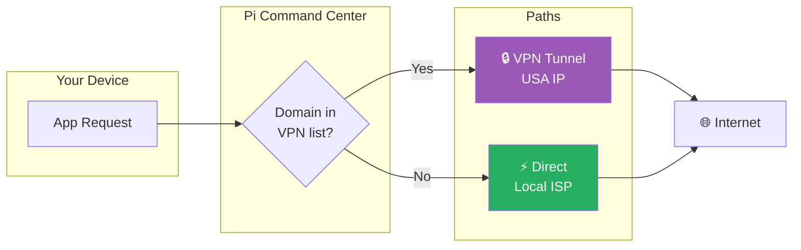
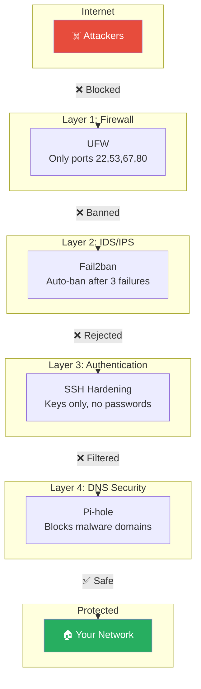
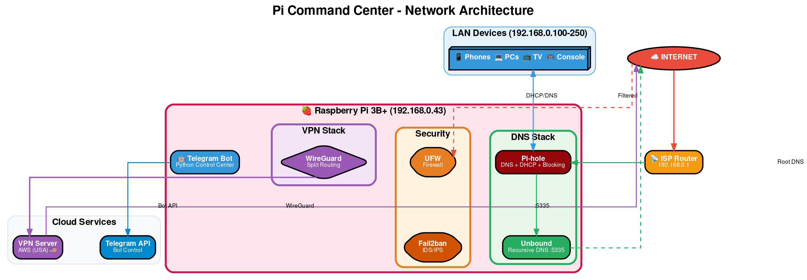
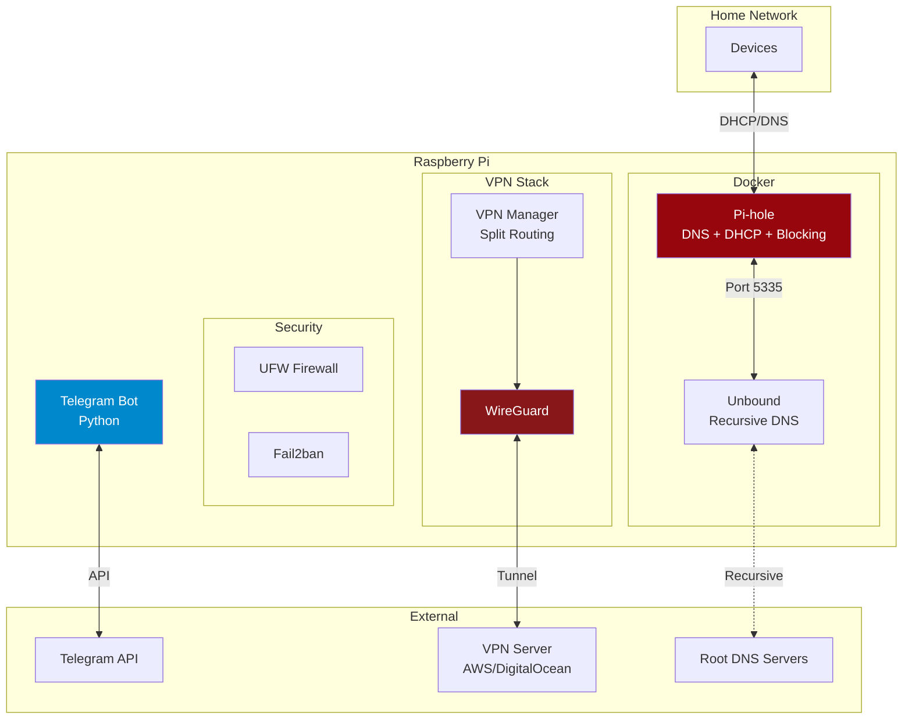
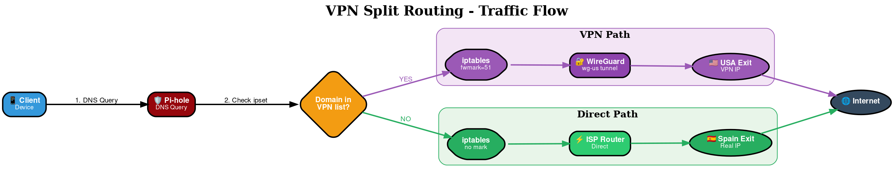

<p align="center">
  
</p>

<h1 align="center">Pi Command Center</h1>

<p align="center">
  <strong>Transform your Raspberry Pi into a privacy-first home network command center</strong>
</p>

<p align="center">
  <a href="#-quick-start">Quick Start</a> •
  <a href="#-features">Features</a> •
  <a href="#-architecture">Architecture</a> •
  <a href="#-use-cases">Use Cases</a> •
  <a href="#-documentation">Docs</a>
</p>

<p align="center">
  
  
  
  
</p>

<p align="center">
  
  
</p>

---

## 🎯 What is This?

**Pi Command Center** turns a $35 Raspberry Pi into a complete home network security and privacy solution. No cloud dependencies. No subscriptions. Full control.

### The Problem

- 🔴 Your ISP sees every website you visit
- 🔴 Ads and trackers follow you across devices
- 🔴 No visibility into what's connected to your network
- 🔴 VPNs are "all or nothing" - slow everything down
- 🔴 Managing home network requires technical expertise

### The Solution

```
┌─────────────────────────────────────────────────────────────┐
│                    Pi Command Center                         │
├─────────────────────────────────────────────────────────────┤
│  ✅ Block ads network-wide (all devices, no apps needed)    │
│  ✅ Private DNS (your queries never leave your home)        │
│  ✅ Smart VPN routing (fast + private when needed)          │
│  ✅ See every device, get alerts for new ones               │
│  ✅ Control everything from Telegram on your phone          │
│  ✅ Intrusion detection and automatic IP banning            │
└─────────────────────────────────────────────────────────────┘
```

---

## 🚀 Quick Start

### One-Command Deploy

```bash
curl -sSL https://raw.githubusercontent.com/judariva/pi-command-center/main/install.sh | bash
```

The interactive installer will guide you through:
- 🔧 System detection and Docker installation
- 🤖 Telegram bot configuration
- 🌐 Network and DHCP settings
- 🔒 Security hardening options

### Manual Installation

```bash
# Clone
git clone https://github.com/judariva/pi-command-center.git
cd pi-command-center

# Configure
cp .env.example .env
nano .env  # Add your Telegram bot token

# Deploy
docker-compose up -d

# Done! Open Telegram and message your bot
```

---

## ✨ Features

### 🛡️ Network-Wide Ad Blocking

Every device on your network is protected automatically. No apps to install. Works on Smart TVs, gaming consoles, IoT devices - everything.

| Without Pi Command Center | With Pi Command Center |
|---------------------------|------------------------|
| Ads on YouTube app | Reduced ads* |
| Tracking across websites | Blocked |
| Malware domains accessible | Blocked |
| Smart TV phoning home | Blocked |

*YouTube ads require additional solutions as they're served from the same domain

### 🔐 Smart VPN Split Routing

**The killer feature.** Most VPNs route ALL traffic through the tunnel, making everything slow. We route intelligently:



**Example Configuration:**
- `netflix.com` → VPN (access US library)
- `reddit.com` → VPN (privacy)
- `google.com` → Direct (speed)
- `banking.es` → Direct (local access required)

### 📱 Telegram Control Center

Control your entire home network from your phone. No apps to install, no ports to open.

```
┌────────────────────────────────────┐
│  🏠 Pi Command Center              │
├────────────────────────────────────┤
│                                    │
│  🌐 IP: 85.x.x.x (Spain)          │
│  🛡️ 1,247 ads blocked today       │
│  📱 8 devices online               │
│  🔐 VPN: Split Mode (15 domains)   │
│  🖥️ CPU: 12% | 52°C               │
│                                    │
├────────────────────────────────────┤
│ [🔍 Network] [🛡️ Pi-hole]         │
│ [🖥️ System] [📱 Devices]          │
│ [🔐 VPN]    [🔒 Security]         │
│ [🔧 Tools]                         │
├────────────────────────────────────┤
│         [🔄 Refresh]               │
└────────────────────────────────────┘
```

### 🔒 Security Stack

Defense in depth - multiple layers of protection:



---

## 🏗️ Architecture

### Network Topology



### System Components



### VPN Split Routing Deep Dive



**How it works:**

1. **DNS Resolution**: Pi-hole resolves domain names
2. **ipset Tagging**: Matching domains add IPs to an ipset
3. **Packet Marking**: iptables mangle marks packets to ipset IPs with fwmark
4. **Policy Routing**: Marked packets use VPN routing table
5. **Tunnel**: Marked traffic exits via WireGuard

```bash
# The magic commands (simplified)
ipset create vpn-domains hash:ip
iptables -t mangle -A OUTPUT -m set --match-set vpn-domains dst -j MARK --set-mark 51
ip rule add fwmark 51 table 51
ip route add default dev wg0 table 51
```

---

## 📋 Use Cases

### 🏠 Family Home

> *"I want to protect my kids from ads and inappropriate content, see what devices are connected, and not worry about security."*

**Solution:**
- Pi-hole blocks ads on all devices automatically
- Add blocklists for adult content
- Get Telegram alerts when new devices connect
- Fail2ban protects against hackers

### 🎬 Streaming Enthusiast

> *"I want to access US Netflix/HBO, but my local streaming and gaming should stay fast."*

**Solution:**
- Add `netflix.com`, `hbomax.com` to VPN list
- Streaming services see US IP
- Local content and gaming stay on fast direct connection
- Switch to "All VPN" mode when needed

### 🔒 Privacy Advocate

> *"I don't trust my ISP. I want maximum privacy without sacrificing usability."*

**Solution:**
- Unbound resolves DNS directly to root servers (no Google/Cloudflare)
- VPN for sensitive browsing
- No external dependencies or cloud services
- All data stays in your home

### 👨‍💻 Remote Worker

> *"I need to access my home network securely when traveling."*

**Solution:**
- WireGuard VPN for secure remote access
- Telegram bot works from anywhere
- Monitor home network while away
- Get security alerts in real-time

### 🏢 Small Office

> *"We need basic security and content filtering for our small team."*

**Solution:**
- Network-wide ad blocking saves bandwidth
- Block social media during work hours
- See all connected devices
- Basic intrusion detection

---

## 📊 Performance

Tested on Raspberry Pi 3B+ (1GB RAM):

| Metric | Value |
|--------|-------|
| DNS queries/second | ~1,000 |
| Memory usage | ~400MB |
| CPU usage (idle) | ~5% |
| CPU usage (active) | ~15% |
| Boot to operational | ~45 seconds |
| Ad blocking latency | <1ms |

---

## 🐳 Docker Architecture

```yaml
# Full stack in Docker
services:
  pihole:        # DNS, DHCP, Ad blocking
  unbound:       # Recursive DNS resolver
  pibot:         # Telegram bot (NEW!)
  wireguard:     # VPN client (optional)
```

### Why Docker?

- ✅ **Portable**: Works on any Pi, easy backup/restore
- ✅ **Isolated**: Services don't interfere with each other
- ✅ **Updatable**: `docker-compose pull && docker-compose up -d`
- ✅ **Reproducible**: Same config = same result

---

## 📚 Documentation

| Document | Description |
|----------|-------------|
| [Installation Guide](docs/INSTALLATION.md) | Step-by-step setup |
| [Pi-hole + Unbound Setup](docs/PIHOLE_SETUP.md) | DNS stack configuration |
| [VPN Setup Guide](docs/VPN_SETUP.md) | WireGuard + split routing |
| [Security Hardening](docs/SECURITY.md) | SSH, Fail2ban, UFW |
| [Telegram Bot](docs/BOT.md) | Bot features and commands |
| [Troubleshooting](docs/TROUBLESHOOTING.md) | Common issues |
| [API Reference](docs/API.md) | For developers |

---

## 🗺️ Roadmap

### v1.0 (Current)
- [x] Pi-hole + Unbound DNS stack
- [x] Telegram bot with full control
- [x] VPN split routing
- [x] Security monitoring (Fail2ban)
- [x] Device tracking

### v1.1 (Next)
- [ ] Full Docker Compose deployment
- [ ] Web dashboard (alternative to Telegram)
- [ ] Automated backups
- [ ] One-command installer

### v2.0 (Future)
- [ ] Parental controls with schedules
- [ ] Bandwidth monitoring per device
- [ ] Multiple VPN endpoints
- [ ] Home Assistant integration
- [ ] Mobile app

---

## 🤝 Contributing

Contributions are welcome! See [CONTRIBUTING.md](CONTRIBUTING.md) for guidelines.

### Development Setup

```bash
# Clone with dev dependencies
git clone https://github.com/judariva/pi-command-center.git
cd pi-command-center

# Create virtual environment
python3 -m venv venv
source venv/bin/activate

# Install dev dependencies
pip install -r requirements-dev.txt

# Run tests
pytest

# Run linter
flake8
```

---

## 📜 License

MIT License - see [LICENSE](LICENSE) for details.

Use it, modify it, sell it, whatever. Just don't blame me if something breaks. 😄

---

## 🙏 Acknowledgments

This project stands on the shoulders of giants:

- [Pi-hole](https://pi-hole.net/) - The original network-wide ad blocker
- [Unbound](https://nlnetlabs.nl/projects/unbound/) - Privacy-focused DNS resolver
- [WireGuard](https://www.wireguard.com/) - Modern, fast, secure VPN
- [python-telegram-bot](https://python-telegram-bot.org/) - Excellent Telegram API wrapper
- [Fail2ban](https://www.fail2ban.org/) - Intrusion prevention

---

## ⭐ Star History

If this project helped you, consider giving it a star! It helps others discover it.

---

<p align="center">
  Made with ❤️ by <a href="https://github.com/judariva">judariva</a>
</p>

<p align="center">
  <a href="https://www.linkedin.com/in/judariva">LinkedIn</a> •
  <a href="https://twitter.com/judariva">Twitter</a>
</p>
