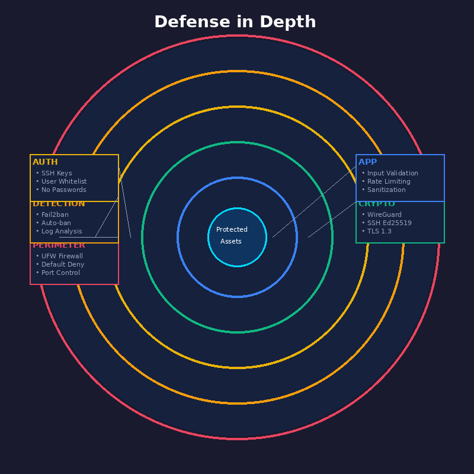

<div align="center">


# Pi Command Center

Transform your Raspberry Pi into a privacy-first home network control center


[](LICENSE)
[](docker-compose.yml)
[](requirements.txt)

[Installation](#installation) · [Features](#features) · [Architecture](#architecture) · [Documentation](#documentation)

</div>

---

## Overview

Pi Command Center provides complete control over your home network's DNS, security, and privacy. Deploy with one command on any Raspberry Pi.

| Capability | Implementation |
|------------|----------------|
| DNS Resolution | Unbound recursive resolver (no third-party DNS) |
| Ad Blocking | Pi-hole with 1M+ blocked domains |
| VPN Routing | WireGuard with domain-based split tunneling |
| Remote Control | Telegram bot interface |
| Security | UFW firewall + Fail2ban intrusion detection |

---

## Installation

### Quick Start

```bash
curl -sSL https://raw.githubusercontent.com/judariva/pi-command-center/main/install.sh | bash
```

### Manual

```bash
git clone https://github.com/judariva/pi-command-center.git
cd pi-command-center
cp .env.example .env
# Configure your Telegram bot token in .env
docker compose up -d
```

### Requirements

- Raspberry Pi 3B+ or newer (ARM64)
- Docker and Docker Compose
- Telegram bot token from [@BotFather](https://t.me/BotFather)

---

## Features

### Private DNS

All DNS queries are resolved recursively through Unbound. Your browsing data never touches Google, Cloudflare, or any third-party DNS provider.

### Network-Wide Ad Blocking

Pi-hole blocks ads and trackers for every device on your network. No client-side configuration required.

### Smart VPN Routing

<div align="center">

</div>

Route specific domains through VPN while keeping local traffic fast:

```
netflix.com     → VPN (geo-unlock)
reddit.com      → VPN (privacy)
google.com      → Direct (speed)
local services  → Direct (no latency)
```

### Security Monitoring

<div align="center">

</div>

- Automatic IP banning after failed SSH attempts
- Real-time intrusion alerts via Telegram
- Key-only SSH authentication

---

## Architecture

<div align="center">

</div>

### Component Overview

```
┌─────────────────────────────────────────────────────────┐
│                    RASPBERRY PI                         │
│  ┌─────────────┐  ┌─────────────┐  ┌─────────────────┐ │
│  │   Pi-hole   │→ │   Unbound   │→ │  Root Servers   │ │
│  │  DNS/DHCP   │  │  Recursive  │  │                 │ │
│  └─────────────┘  └─────────────┘  └─────────────────┘ │
│  ┌─────────────┐  ┌─────────────┐  ┌─────────────────┐ │
│  │  WireGuard  │  │   Fail2ban  │  │       UFW       │ │
│  │     VPN     │  │     IDS     │  │    Firewall     │ │
│  └─────────────┘  └─────────────┘  └─────────────────┘ │
│  ┌─────────────────────────────────────────────────────┐│
│  │              Telegram Bot (pibot)                   ││
│  └─────────────────────────────────────────────────────┘│
└─────────────────────────────────────────────────────────┘
```

### Docker Stack

| Service | Port | Purpose |
|---------|------|---------|
| `unbound` | 5335 | Recursive DNS resolver |
| `pihole` | 53, 80 | DNS server + ad blocking + DHCP |
| `pibot` | - | Telegram control interface |

---

## Configuration

All settings are managed through environment variables:

```bash
# Required
TELEGRAM_BOT_TOKEN=your_token_here
AUTHORIZED_USERS=123456789

# Optional
NETWORK_RANGE=192.168.1.0/24
PIHOLE_PASSWORD=your_password
TZ=UTC
```

See [.env.example](.env.example) for all available options.

---

## Documentation

| Document | Description |
|----------|-------------|
| [Technical Specification](docs/TECHNICAL_SPEC.md) | Complete system architecture |
| [Pi-hole Setup](docs/PIHOLE_SETUP.md) | DNS and DHCP configuration |
| [VPN Setup](docs/VPN_SETUP.md) | WireGuard split routing |

---

## Bot Commands

| Command | Description |
|---------|-------------|
| `/start` | Main menu |
| `/status` | System status |
| `/devices` | Network scan |
| `/vpn` | VPN control |

---

## Contributing

1. Fork the repository
2. Create a feature branch
3. Submit a pull request

---

## License

MIT License. See [LICENSE](LICENSE) for details.
