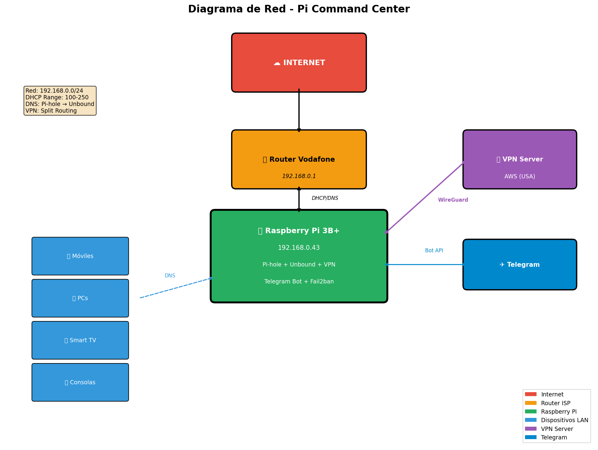
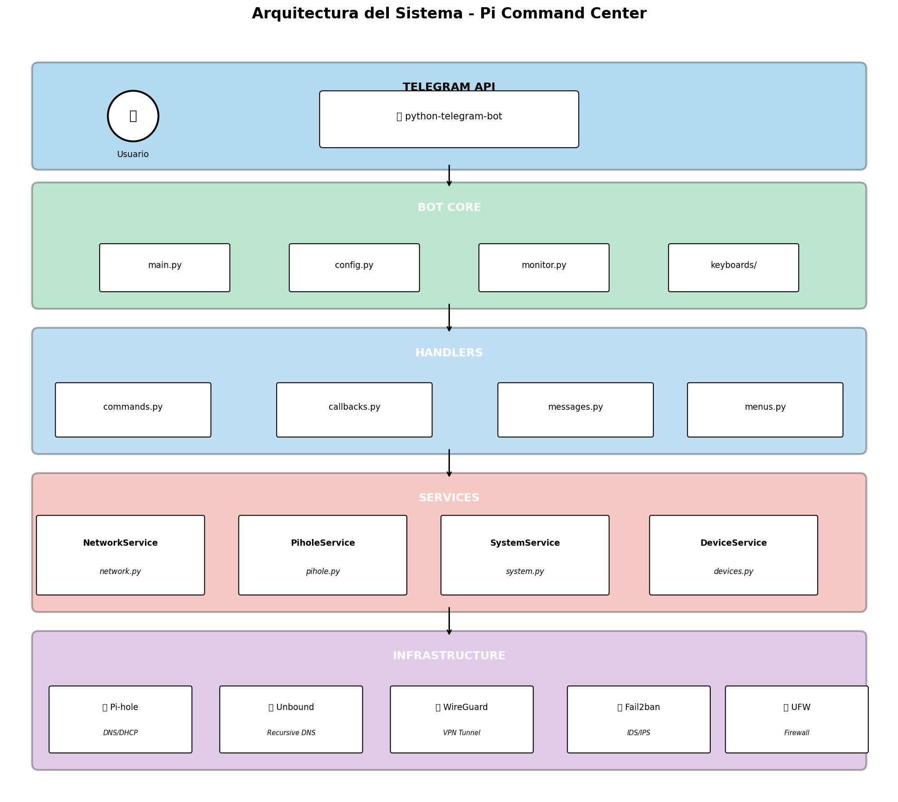
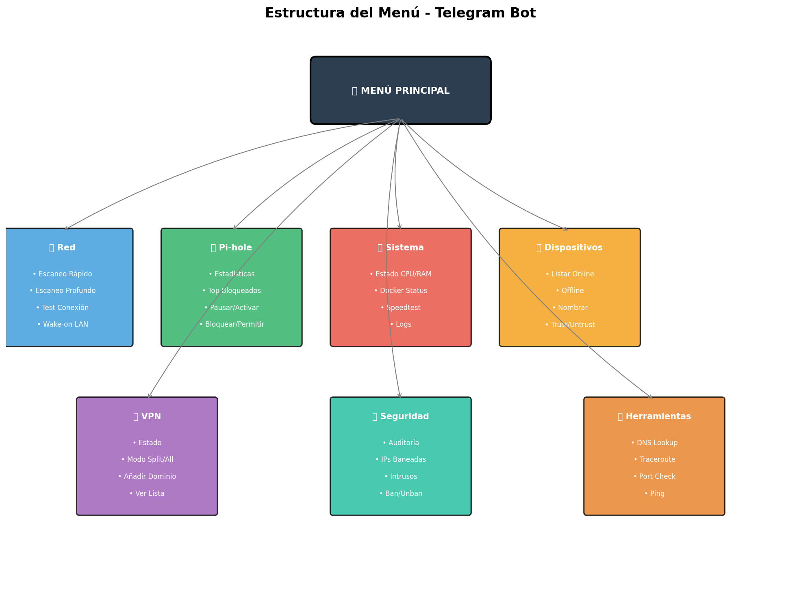

# 🍓 Pi Command Center

> **Centro de Control Doméstico** - Un sistema completo de gestión de red y seguridad para Raspberry Pi con control total via Telegram.

[](https://python.org)
[](https://core.telegram.org/bots/api)
[](https://pi-hole.net/)
[](https://www.wireguard.com/)
[](LICENSE)

---

## 📋 Tabla de Contenidos

- [Características](#-características)
- [Arquitectura](#-arquitectura)
- [Requisitos](#-requisitos)
- [Instalación](#-instalación)
- [Configuración](#-configuración)
- [Uso del Bot](#-uso-del-bot)
- [VPN Split Routing](#-vpn-split-routing)
- [Seguridad](#-seguridad)
- [Estructura del Proyecto](#-estructura-del-proyecto)
- [API Reference](#-api-reference)
- [Troubleshooting](#-troubleshooting)
- [Contributing](#-contributing)

---

## ✨ Características

### 🛡️ DNS & Ad-Blocking
- **Pi-hole** como servidor DNS y DHCP
- **Unbound** para resolución DNS recursiva (máxima privacidad)
- Bloqueo de anuncios y malware a nivel de red
- Estadísticas en tiempo real

### 🔐 VPN Split Routing
- **WireGuard** con enrutamiento selectivo
- Modo Split: solo dominios específicos por VPN
- Modo Todo VPN: todo el tráfico cifrado
- Gestión dinámica de dominios

### 🔒 Seguridad
- SSH hardening (solo claves Ed25519)
- Fail2ban para protección contra brute force
- UFW firewall configurado
- Alertas de intrusión en tiempo real

### 📱 Control via Telegram
- Dashboard en tiempo real
- Gestión de dispositivos
- Control de VPN
- Herramientas de red (ping, traceroute, DNS lookup)
- Panel de seguridad

### 📊 Monitorización
- Estado del sistema (CPU, RAM, temperatura)
- Detección de nuevos dispositivos
- Alertas automáticas
- Logs centralizados

---

## 🏗 Arquitectura

### Diagrama de Red



```
Internet
    │
    ▼
┌─────────────────┐
│  Router ISP    │ 192.168.0.1
│   (Vodafone)   │
└────────┬────────┘
         │
         ▼
┌─────────────────────────────────────┐
│      🍓 Raspberry Pi 3B+            │
│         PI_IP_REDACTED                │
│                                     │
│  ┌─────────┐  ┌─────────────────┐  │
│  │ Pi-hole │──│ Unbound (5335)  │  │
│  │  (DNS)  │  │ Recursive DNS   │  │
│  └─────────┘  └─────────────────┘  │
│                                     │
│  ┌─────────┐  ┌─────────────────┐  │
│  │WireGuard│  │  Telegram Bot   │  │
│  │  (VPN)  │  │   (Control)     │  │
│  └─────────┘  └─────────────────┘  │
│                                     │
│  ┌─────────┐  ┌─────────────────┐  │
│  │Fail2ban │  │      UFW        │  │
│  │  (IDS)  │  │   (Firewall)    │  │
│  └─────────┘  └─────────────────┘  │
└─────────────────────────────────────┘
         │
         ▼
┌─────────────────┐
│  Dispositivos   │ 192.168.0.100-250
│  📱💻📺🎮      │
└─────────────────┘
```

### Arquitectura del Software



### Flujo VPN Split Routing


### Capas de Seguridad


---

## 📋 Requisitos

### Hardware
- Raspberry Pi 3B+ o superior
- Tarjeta microSD 16GB+ (recomendado 32GB)
- Alimentación 5V/2.5A

### Software
- Raspberry Pi OS Lite (64-bit recomendado)
- Python 3.11+
- Docker & Docker Compose
- WireGuard

### Red
- IP estática para la Raspberry Pi
- Acceso al router para configurar DHCP
- Servidor VPN externo (AWS, DigitalOcean, etc.)

---

## 🚀 Instalación

### 1. Clonar el repositorio

```bash
git clone https://github.com/judariva/pi-command-center.git
cd pi-command-center
```

### 2. Configurar el sistema

```bash
# Ejecutar script de instalación
chmod +x scripts/install.sh
./scripts/install.sh
```

### 3. Configurar variables de entorno

```bash
cp .env.example .env
nano .env
```

Editar las variables:
```env
TELEGRAM_BOT_TOKEN=your_bot_token
AUTHORIZED_USERS=123456789
PIHOLE_API_URL=http://localhost/admin/api.php
PIHOLE_API_KEY=your_pihole_api_key
```

### 4. Instalar dependencias Python

```bash
python3 -m venv venv
source venv/bin/activate
pip install -r requirements.txt
```

### 5. Configurar servicios del sistema

```bash
sudo cp systemd/pibot.service /etc/systemd/system/
sudo systemctl daemon-reload
sudo systemctl enable pibot
sudo systemctl start pibot
```

---

## ⚙️ Configuración

### Pi-hole + Unbound (Docker)

Ver [docs/PIHOLE_SETUP.md](docs/PIHOLE_SETUP.md) para configuración detallada.

```bash
cd docker
docker-compose up -d
```

### WireGuard VPN

Ver [docs/VPN_SETUP.md](docs/VPN_SETUP.md) para configuración del servidor VPN.

```bash
# Copiar configuración
sudo cp configs/wg-us.conf /etc/wireguard/

# Instalar vpn-manager
sudo cp scripts/vpn-manager /usr/local/bin/
sudo chmod +x /usr/local/bin/vpn-manager
```

### SSH Hardening

```bash
sudo cp configs/sshd_hardening.conf /etc/ssh/sshd_config.d/
sudo systemctl restart ssh
```

### Fail2ban

```bash
sudo cp configs/jail.local /etc/fail2ban/
sudo systemctl restart fail2ban
```

---

## 🤖 Uso del Bot

### Estructura del Menú



### Comandos Disponibles

| Comando | Descripción |
|---------|-------------|
| `/start` | Muestra el menú principal |
| `/help` | Ayuda y documentación |
| `/status` | Estado rápido del sistema |

### Menús Inline

#### 🏠 Menú Principal
- Dashboard con estado en tiempo real
- IP pública, dispositivos, VPN, sistema

#### 🔍 Red
- Escaneo de dispositivos
- Test de conectividad
- Wake-on-LAN
- Estadísticas de red

#### 🛡 Pi-hole
- Estadísticas de bloqueo
- Top dominios bloqueados/permitidos
- Pausar/activar
- Bloquear/permitir dominios

#### 🖥️ Sistema
- Estado CPU/RAM/Temperatura
- Docker containers
- Speedtest
- Logs

#### 📱 Dispositivos
- Listar online/offline
- Nombrar dispositivos
- Marcar como confiables
- Scan de puertos

#### 🔐 VPN
- Estado del túnel
- Cambiar modo (Split/Todo)
- Gestionar dominios
- Test de IP

#### 🔒 Seguridad
- Auditoría del sistema
- IPs baneadas
- Intentos de intrusión
- Ban/Unban manual

#### 🔧 Herramientas
- DNS Lookup
- Traceroute
- Port Check
- Ping

---

## 🔀 VPN Split Routing

### Cómo Funciona

El sistema utiliza **iptables mangle + fwmark + policy routing** para enrutar selectivamente el tráfico.

```
┌──────────────┐    ┌─────────────┐    ┌──────────────┐
│   Cliente    │───▶│   Pi-hole   │───▶│  ¿En ipset?  │
└──────────────┘    └─────────────┘    └──────┬───────┘
                                              │
                    ┌─────────────────────────┼─────────────────────────┐
                    │                         │                         │
                    ▼ SÍ                      │                         ▼ NO
           ┌──────────────┐                   │                ┌──────────────┐
           │  WireGuard   │                   │                │   Directo    │
           │  (VPN USA)   │                   │                │  (ISP local) │
           └──────────────┘                   │                └──────────────┘
                    │                         │                         │
                    └─────────────────────────┼─────────────────────────┘
                                              ▼
                                        ┌──────────┐
                                        │ Internet │
                                        └──────────┘
```

### Modos

#### Modo Split (Por defecto)
- Solo dominios en la lista pasan por VPN
- El resto va directo por el ISP
- Mejor rendimiento para servicios locales

#### Modo Todo VPN
- Todo el tráfico pasa por VPN
- Máxima privacidad
- Mayor latencia

### Gestión de Dominios

```bash
# Añadir dominio
sudo vpn-manager add-domain netflix.com

# Ver lista
sudo vpn-manager list-domains

# Estado
sudo vpn-manager status
```

---

## 🛡 Seguridad

### Capas de Protección

1. **UFW Firewall**
   - Solo puertos necesarios abiertos
   - Reglas por defecto deny

2. **Fail2ban**
   - Protección SSH
   - Ban automático tras 3 intentos
   - Duración: 1 hora

3. **SSH Hardening**
   - Solo autenticación por clave
   - Root login deshabilitado
   - Solo usuario autorizado

4. **Pi-hole**
   - Bloqueo de dominios maliciosos
   - Listas de malware actualizadas

5. **VPN**
   - Cifrado WireGuard
   - Tráfico sensible protegido

### Buenas Prácticas

```bash
# Verificar estado de seguridad
sudo fail2ban-client status sshd
sudo ufw status verbose

# Ver intentos de intrusión
sudo journalctl -u ssh --since "24 hours ago" | grep "Failed"
```

---

## 📁 Estructura del Proyecto

```
pi-command-center/
├── 📄 README.md
├── 📄 requirements.txt
├── 📄 .env.example
├── 📄 LICENSE
│
├── 📂 config.py              # Configuración central
├── 📂 main.py                # Punto de entrada
├── 📂 monitor.py             # Monitor de red
│
├── 📂 handlers/              # Handlers del bot
│   ├── __init__.py
│   ├── commands.py           # Comandos /start, /help
│   ├── callbacks.py          # Botones inline
│   └── messages.py           # Mensajes de texto
│
├── 📂 keyboards/             # Teclados inline
│   ├── __init__.py
│   └── menus.py
│
├── 📂 services/              # Lógica de negocio
│   ├── __init__.py
│   ├── network.py            # Escaneo de red
│   ├── pihole.py             # API de Pi-hole
│   ├── system.py             # Estado del sistema
│   └── devices.py            # Gestión de dispositivos
│
├── 📂 utils/                 # Utilidades
│   ├── __init__.py
│   ├── shell.py              # Ejecución de comandos
│   └── formatting.py         # Formateo de mensajes
│
├── 📂 scripts/               # Scripts de instalación
│   ├── install.sh
│   └── vpn-manager
│
├── 📂 configs/               # Archivos de configuración
│   ├── wg-us.conf
│   ├── sshd_hardening.conf
│   └── jail.local
│
├── 📂 systemd/               # Servicios systemd
│   └── pibot.service
│
├── 📂 docker/                # Docker Compose
│   ├── docker-compose.yml
│   └── unbound/
│       └── unbound.conf
│
└── 📂 docs/                  # Documentación
    ├── PIHOLE_SETUP.md
    ├── VPN_SETUP.md
    ├── generate_diagrams.py
    └── diagrams/
        ├── network_diagram.png
        ├── architecture_diagram.png
        ├── vpn_flow_diagram.png
        ├── security_layers.png
        └── bot_menu_structure.png
```

---

## 📚 API Reference

### NetworkService

```python
from services import NetworkService

net_svc = NetworkService()

# Escanear red
devices = await net_svc.scan_all()

# Check conectividad
results = await net_svc.check_connectivity()

# DNS lookup
records = await net_svc.dns_lookup("google.com")
```

### PiholeService

```python
from services import PiholeService

pihole = PiholeService()

# Estadísticas
stats = pihole.get_stats()

# Bloquear dominio
pihole.block_domain("facebook.com")

# Pausar Pi-hole
pihole.disable(300)  # 5 minutos
```

### SystemService

```python
from services import SystemService

sys_svc = SystemService()

# Estado del sistema
stats = sys_svc.get_stats()
# → SystemStats(cpu_percent=15.2, memory_percent=45.0, temperature=52.3, ...)

# Containers Docker
containers = sys_svc.get_containers()
```

---

## 🔧 Troubleshooting

### El bot no responde

```bash
# Verificar estado
sudo systemctl status pibot

# Ver logs
sudo journalctl -u pibot -f

# Reiniciar
sudo systemctl restart pibot
```

### VPN no conecta

```bash
# Verificar WireGuard
sudo wg show

# Verificar reglas
sudo vpn-manager status

# Reiniciar VPN
sudo vpn-manager vpn-down
sudo vpn-manager vpn-up
```

### Dispositivo no recibe IP

```bash
# Verificar DHCP de Pi-hole
docker logs pihole | grep dhcp

# Verificar interfaz
ip addr show eth0
```

### Fail2ban no banea

```bash
# Verificar configuración
sudo fail2ban-client status sshd

# Ver logs
sudo journalctl -u fail2ban
```

---

## 🤝 Contributing

1. Fork el repositorio
2. Crea una rama (`git checkout -b feature/nueva-funcionalidad`)
3. Commit tus cambios (`git commit -am 'Añade nueva funcionalidad'`)
4. Push a la rama (`git push origin feature/nueva-funcionalidad`)
5. Abre un Pull Request

---

## 📄 License

Este proyecto está licenciado bajo la Licencia MIT - ver [LICENSE](LICENSE) para detalles.

---

## 👨‍💻 Autor

**judariva** - [GitHub](https://github.com/judariva)

---

## 🙏 Agradecimientos

- [Pi-hole](https://pi-hole.net/) - DNS sinkhole
- [Unbound](https://nlnetlabs.nl/projects/unbound/) - DNS resolver
- [WireGuard](https://www.wireguard.com/) - VPN moderno
- [python-telegram-bot](https://python-telegram-bot.org/) - API wrapper
- [Fail2ban](https://www.fail2ban.org/) - Protección contra intrusos
