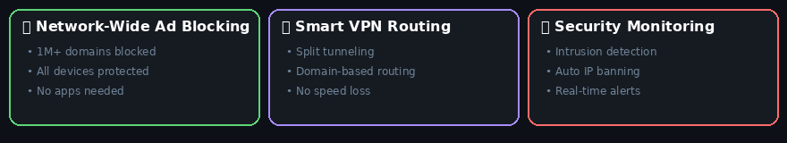
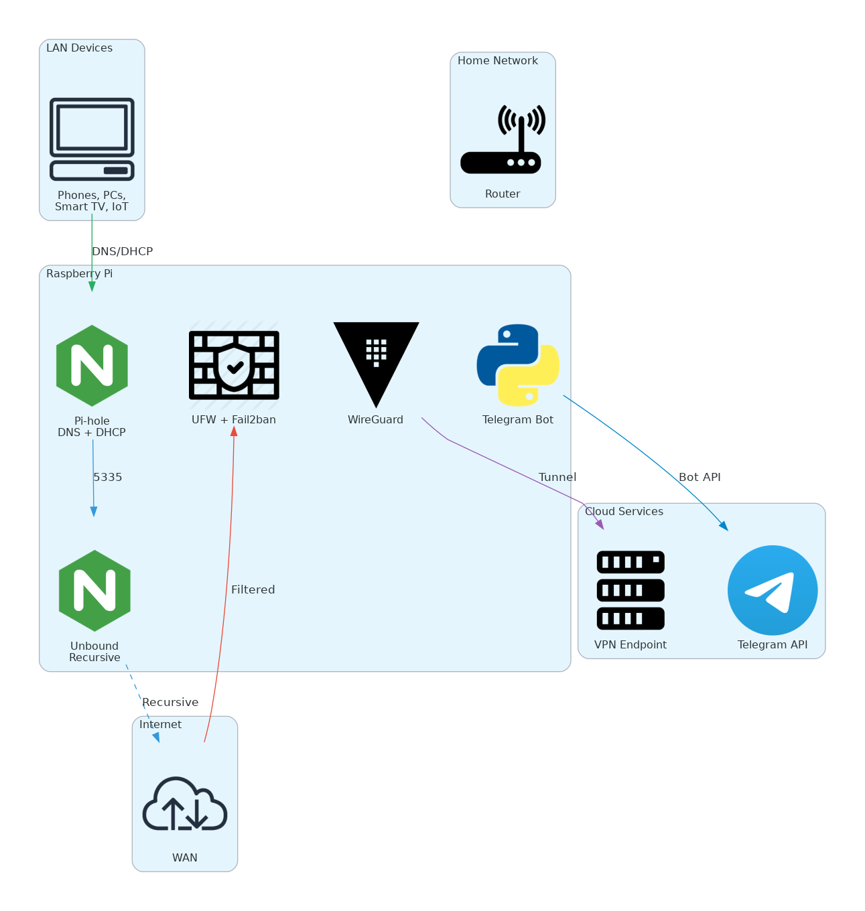
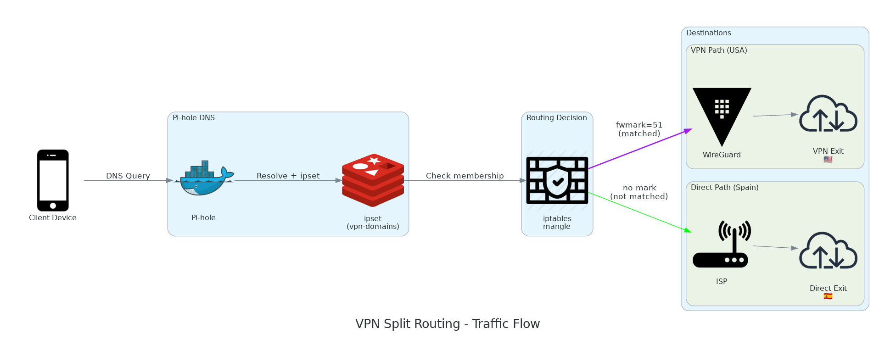
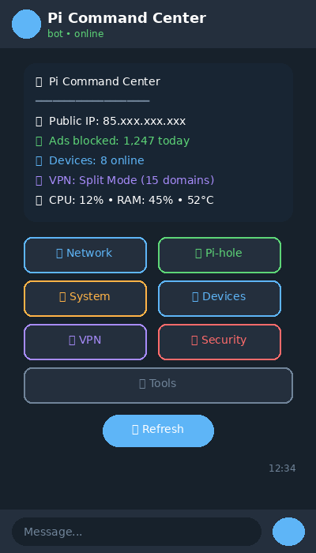
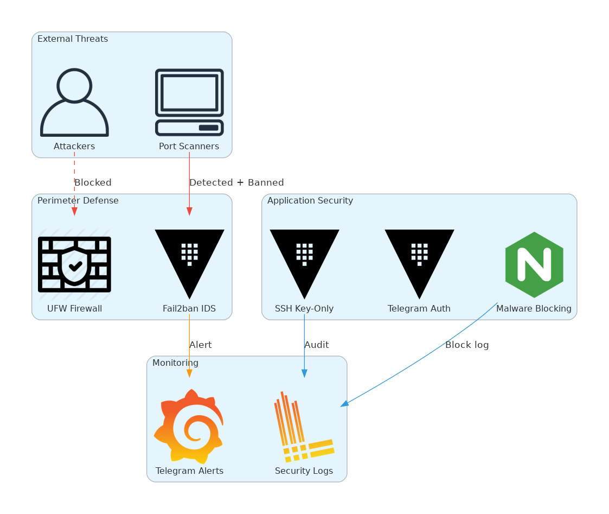
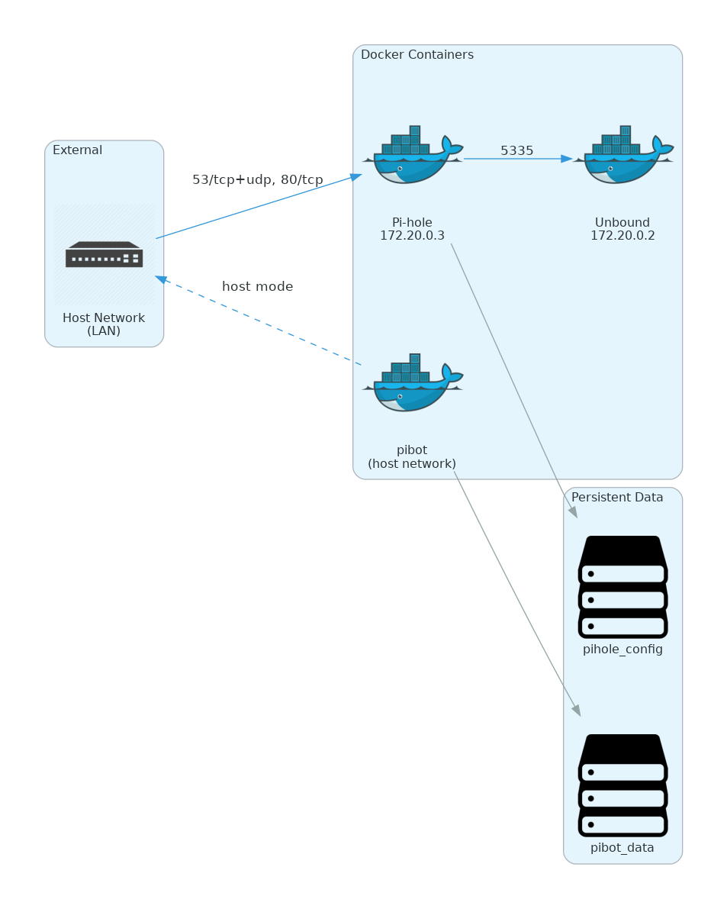

<div align="center">

# Pi Command Center

**Privacy-first home network control center on Raspberry Pi**

[](https://www.raspberrypi.org/)
[](https://python.org)
[](https://docker.com)
[](LICENSE)

[Features](#features) • [Quick Start](#quick-start) • [Architecture](#architecture) • [Documentation](#documentation)

</div>

---

## What It Does

Transform a Raspberry Pi into a complete home network security solution:

| Problem | Solution |
|---------|----------|
| ISP tracks all DNS queries | Private recursive DNS (Unbound) |
| Ads on all devices | Network-wide blocking (Pi-hole) |
| VPN slows everything | Smart split routing (domain-based) |
| No network visibility | Device monitoring + alerts |
| Complex management | Telegram bot control |

---

## Features

<div align="center">

</div>

### Ad Blocking
- 1M+ domains blocked network-wide
- Works on all devices (Smart TV, IoT, phones)
- No apps to install

### Private DNS
- Recursive resolution via Unbound
- Queries never leave your network
- No Google/Cloudflare middleman

### VPN Split Routing
- Route only specific domains through VPN
- Keep local services fast
- Automatic failover

### Telegram Control
- Full network management from phone
- Real-time alerts
- No ports exposed

---

## Quick Start

### One-Command Install

```bash
curl -sSL https://raw.githubusercontent.com/judariva/pi-command-center/main/install.sh | bash
```

### Manual Install

```bash
git clone https://github.com/judariva/pi-command-center.git
cd pi-command-center
cp .env.example .env
# Edit .env with your Telegram bot token
docker compose up -d
```

### Requirements

- Raspberry Pi 3B+ / 4 / 5 (or any Debian/Ubuntu system)
- Docker & Docker Compose
- Telegram bot token ([create one](https://t.me/BotFather))

---

## Architecture

<div align="center">

</div>

### DNS Flow

```
Client → Pi-hole (DNS/DHCP) → Unbound (Recursive) → Root Servers
                ↓
         Ad blocking
         (0.0.0.0)
```

### VPN Split Routing

<div align="center">

</div>

Traffic is routed based on domain:
- **VPN**: netflix.com, reddit.com (privacy/geo-unlock)
- **Direct**: google.com, local services (speed)

---

## Bot Interface

<div align="center">

</div>

**Commands:**
- `/start` - Main menu
- `/status` - Quick status
- `/vpn` - VPN control
- `/devices` - Network scan

---

## Security

<div align="center">

</div>

- **UFW**: Firewall with strict rules
- **Fail2ban**: Auto-ban after failed attempts
- **SSH**: Key-only authentication
- **Telegram**: Authorized users only

---

## Docker Stack

<div align="center">

</div>

| Container | Purpose | Port |
|-----------|---------|------|
| `unbound` | Recursive DNS | 5335 |
| `pihole` | DNS + DHCP + Blocking | 53, 80 |
| `pibot` | Telegram control | - |

---

## Configuration

All settings via environment variables:

```bash
# .env
TELEGRAM_BOT_TOKEN=your_token
AUTHORIZED_USERS=123456789
PIHOLE_PASSWORD=secure_password
NETWORK_RANGE=192.168.1.0/24
```

See [.env.example](.env.example) for all options.

---

## Documentation

| Document | Description |
|----------|-------------|
| [Pi-hole Setup](docs/PIHOLE_SETUP.md) | DNS and DHCP configuration |
| [VPN Setup](docs/VPN_SETUP.md) | WireGuard + split routing |
| [Security](docs/SECURITY.md) | Hardening guide |

---

## Diagram Generation

Regenerate all diagrams from config:

```bash
cd docs/diagrams
python generate.py        # All diagrams
python generate.py --only network  # Specific diagram
```

Edit `config.yaml` to modify diagram content.

---

## License

MIT License. See [LICENSE](LICENSE).

---

<div align="center">

**[⬆ Back to top](#pi-command-center)**

</div>
